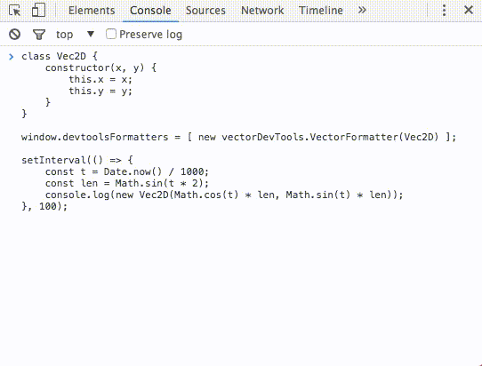
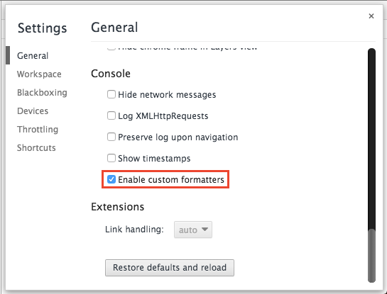

# vector-devtools
vector formatter for chrome devtools.
inspired by [immutable-devtools](https://github.com/andrewdavey/immutable-devtools)


## install
```sh
$ npm install vector-devtools
```


## example
```js
class Vec2D {
    constructor(x, y) {
        this.x = x;
        this.y = y;
    }
}

window.devtoolsFormatters = [ new vectorDevTools.VectorFormatter(Vec2D) ];

setInterval(() => {
    const t = Date.now() / 1000;
    const len = Math.sin(t * 2);
    console.log(new Vec2D(Math.cos(t) * len, Math.sin(t) * len));
}, 100);
```




## how to use

1. open chrome devtools settings
2. check "Enable custom formatters"
3. write and run above example




## license
[zlib](./LICENSE)
